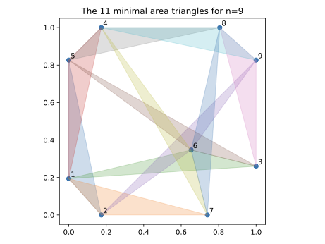

# Heilbronn's Triangle Problem

Code and data for the paper

> N. Sudermann-Merx, *From Computational Certification to Exact Coordinates: Heilbronn's Triangle Problem on the Unit Square*, 2026.

<p align="center">
  
</p>

## Contents

- **app.py** — Interactive visualizer for Heilbronn configurations (drag points to explore)
- **optimization_models/** — Gurobi MIP formulations (baseline and strengthened)
- **best-known-configurations/** — Point configurations for n = 3, …, 16 as JSON
- **exact_coordinates/** — Exact symbolic coordinates for n = 5, …, 9 (SymPy)
- **figures/** — Configuration plots

## Interactive App

The interactive visualization app was conceived by Hendrik Ewe, who also provided the first version.

`app.py` is a Tkinter application that lets you explore the Heilbronn configurations interactively:

- Switch between best-known configurations for n = 3, …, 16
- Drag points with the mouse and see the smallest triangles update in real time
- Critical triangles are colored using the matplotlib tab10 palette (matching the paper figures) with true alpha transparency

```bash
pip install Pillow   # only additional dependency
python app.py
```

## Requirements

- Python ≥ 3.9
- [Pillow](https://python-pillow.org/) (for the interactive app)
- [Gurobi](https://www.gurobi.com/) ≥ 11.0 (for the MIP models)
- [SymPy](https://www.sympy.org/) ≥ 1.14 (for the exact coordinates)

## Usage

```bash
python optimization_models/heilbronn_final.py
python exact_coordinates/exact_coordinates.py 7
```

## Citation

```bibtex
@article{SudermannMerx2026Heilbronn,
  author  = {Sudermann-Merx, Nathan},
  title   = {From Computational Certification to Exact Coordinates:
             {Heilbronn}'s Triangle Problem on the Unit Square},
  year    = {2026},
}
```

## License

MIT
